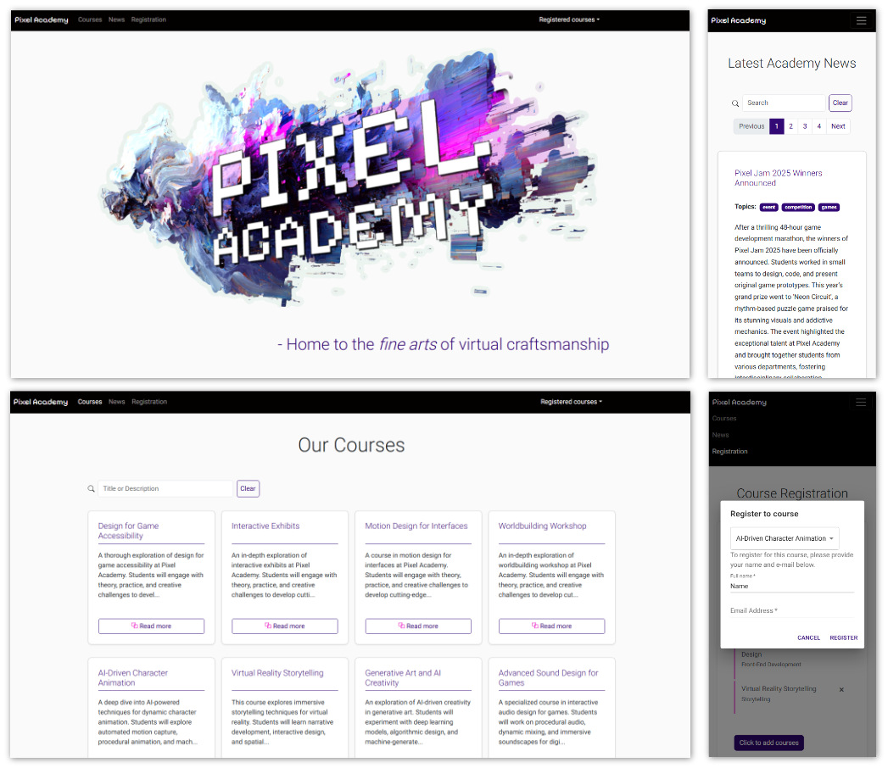

# Student Portal - ⚠️ Readme currently WIP

[Live Page](https://linneatoth.github.io/student_portal/)

This is..

## Features
- **React**, with hooks such as **useState**, **useEffect** 

# Assignment - machine translated from Swedish

> # About the Assignment
>
> You are going to build a **Student Portal** in React.
>
> The app should help students to:
>
> - View information about courses.
> - Read news (blog posts).
> - Register for a course.
>
> The project should use **several important React concepts** as well as an **external UI library** and **Routing**.
>
> # Case
>
> - Set up a new React project using **Vite** or **Create React App**.
> - Use **React Router** for navigation between pages.
> - Use **Bootstrap** to style the layout (e.g., Grid, Cards, Buttons).
> - Use **Material UI** on at least **one important component** (example: a nice registration form or dialog).
> - Build a **responsive** and **user-friendly** app.
>
> # What You Should Do
> ### 1. Routing (React Router)
>
> - Create at least **three pages**:
>     - **Home page** (`/`) – Welcome message and quick menu.
>     - **Courses** (`/courses`) – List of courses (fetched from an array or API).
>     - **News/Blog** (`/news`) – List of news/blog posts.
>
> ### 2. Navbar (Navigation Menu)
>
> - Use a **Bootstrap Navbar** that shows links to all pages.
>
> ### 3. Course List
>
> - Display courses in a **Bootstrap grid**.
> - Each course is displayed in a **Bootstrap Card**.
> - Each course card should show:
>     - Course name
>     - Short description
>     - A **"Read More"** button.
>
> ### 4. Course Details (Dynamic Route)
>
> - When you click "Read More", navigate to a new page `/courses/:id` that shows more information about the course.
> - Use **React Router params** to get the course ID.
>
> ### 5. Registration (Material UI)
>
> **Use `useContext` and the Context API** to keep track of which courses the student has registered for, and share this information across the app.
>
> - Create a page or dialog where a student can register for a course:
>     - The form should use **Material UI TextField** and **Material UI Button**.
>     - The form should include:
>         - Name
>         - Email
>         - Course selection (Dropdown)
>
> ### 6. News / Blog
> - Display a list of blog posts/news.
> - Posts can be hardcoded in an array or fetched from an API (e.g. https://jsonplaceholder.typicode.com/posts).
>
>
> ## ⭐ Extra Challenges (Grade VG)
>
> - **Search function**: Add a search function to the course or news page.
> - **Pagination**: Split news into multiple pages.
> - **Registration validation**: Validate form fields so that error messages are shown when text fields are empty.
> - **Context API**: Use Context to keep track of which courses a student has registered for.
> - **Material UI Dialog**: When clicking "Register", open a Material UI Dialog (popup) instead of a separate page.
> 
